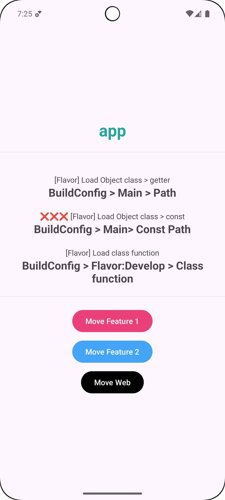
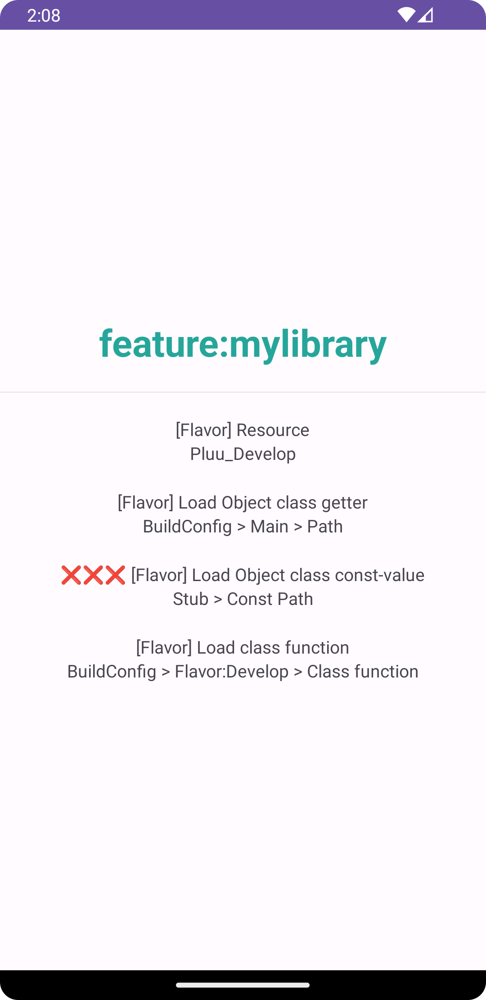
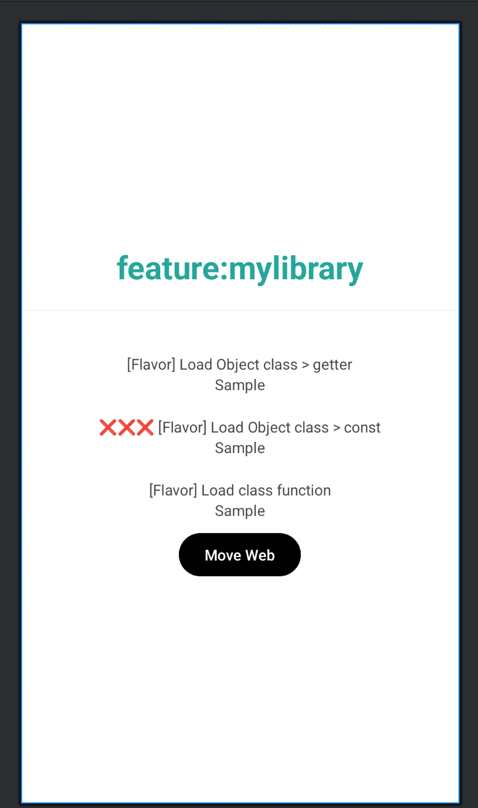

🚧🚧🚧🚧🚧 작업 중 🚧🚧🚧🚧🚧

BuildConfig/BuildConfig-stub 모듈 처리

## 지원 케이스

- ✅ Resource
- ✅ BuildConfig
- ✅ Class
- object class
  - ✅ getter value
  - ❌ const value

## 샘플 

||                App Module                 | Feature Module                                |
|:--:|:-----------------------------------------:|-----------------------------------------------|
|Run|          |          |
|Preview|  |  |